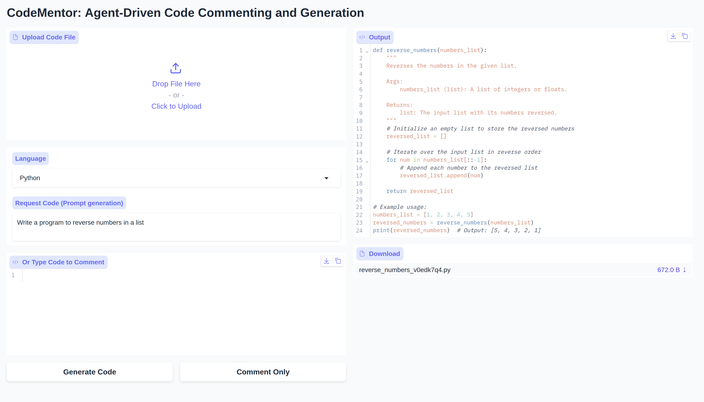
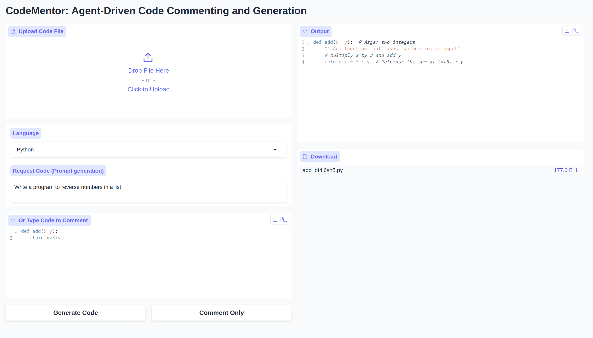

# CodeMentor: Agent-Driven Code Commenting and Generation

**app.py** is a lightweight, agent-driven web app for Python and JavaScript developers. It leverages local LLMs via [Ollama](https://ollama.com/) and a clean Gradio UI to:

- ✍️ **Comment Code** — Automatically add Google-style docstrings (Python) or JSDoc (JavaScript) and inline comments to existing source files.
- ⚙️ **Generate Code** — Describe the desired functionality in natural language and receive fully commented code that’s ready to run.

Under the hood, three agents manage the workflow:

1. **FileTypeAgent** — Determines whether the input is Python or JavaScript.
2. **CommentAgent** — Wraps the Ollama chat API to produce docstrings and inline comments.
3. **CodeGenAgent** — Wraps the Ollama chat API to generate new, commented code.

---

## 📋 Prerequisites

- **Python** ≥ 3.8  
- **Ollama** (local LLaMA 3 or other model runner)  
- **Git** (to clone the repo)  
- **Operating System**: Ubuntu 20.04+ (macOS/Windows supported)

---


## 🖼️ Example Output

<p align="center">
  
  
</p>

<p align="center">
  <strong>Left:</strong> Code Generation &nbsp;&nbsp;&nbsp;&nbsp; <strong>Right:</strong> Comment Generation
</p>


## 🔧 Installation & Setup

1. **Clone the repository**  
   ```bash
   git clone <repository-url>
   cd <repo-folder>
   ```

2. **Install Ollama & pull the model**  
   ```bash
   # Install Ollama if needed
   curl -fsSL https://ollama.com/install.sh | sh

   # Pull the LLaMA 3 model (tagged :latest)
   ollama pull llama3:latest

   # Start the Ollama server
   ollama serve
   ```

3. **Create a Python virtual environment & install dependencies**  
   ```bash
   python -m venv venv
   source venv/bin/activate        # Windows: venv\Scripts\activate
   pip install -r requirements.txt
   ```

=======
## 🔧 Installation & Setup

1. **Clone the repository**  
   ```bash
   git clone <repository-url>
   cd <repo-folder>
   ```

2. **Install Ollama & pull the model**  
   ```bash
   # Install Ollama if needed
   curl -fsSL https://ollama.com/install.sh | sh

   # Pull the LLaMA 3 model (tagged :latest)
   ollama pull llama3:latest

   # Start the Ollama server
   ollama serve
   ```

3. **Create a Python virtual environment & install dependencies**  
   ```bash
   python -m venv venv
   source venv/bin/activate        # Windows: venv\Scripts\activate
   pip install -r requirements.txt
   ```

>>>>>>> 43c1ee1 (updated app_readme)
4. **Run the app**  
   ```bash
   python app.py
   ```
   Then open your browser at: `http://127.0.0.1:7860`.

---

## 🚀 Usage

1. **Comment Code**  
   - Upload a `.py` or `.js` file **or** paste code into the editor.  
   - Select the language (Python/JavaScript).  
   - Click **Comment Only**.  
   - View annotated code in the output pane and download the commented file.

2. **Generate Code**  
   - Enter a natural‑language request (e.g. `Write a Python function to merge two dictionaries`).  
   - Select the language (Python/JavaScript).  
   - Click **Generate Code**.  
   - View generated, fully commented code and download it immediately.

---

## 🛠️ How It Works

- **Ollama Chat API**: All prompts are sent to `POST /api/chat` on your local Ollama server. Responses are parsed from the `message.content` field.  
- **Markdown Stripping**: Fenced code blocks (``` … ```) are automatically removed so the returned code runs out‑of‑the‑box.  
- **Agents**: Clear separation of concerns — file typing, commenting logic, and code generation logic are encapsulated in three simple Python classes.

---

## 🐞 Troubleshooting

- **Ollama Server Down**: If you see `Error: cannot reach Ollama`, run `ollama serve` and verify port 11434 is listening:  
  ```bash
  lsof -i :11434
  ```

- **Model Not Found**: If you get a model error, pull the correct tag:  
  ```bash
  ollama pull llama3:latest
  ```

- **Gradio Fails to Launch**: Ensure you’re in the virtualenv and run:  
  ```bash
  pip install gradio
  python app.py
  ```

<<<<<<< HEAD
---

Made with ♥ by the CodeMentor team. Contributions and issues are welcome on GitHub!
=======

>>>>>>> 43c1ee1 (updated app_readme)
